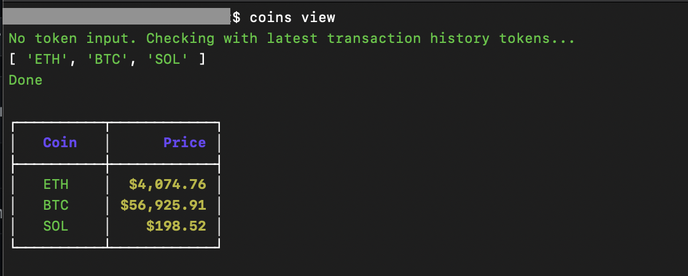
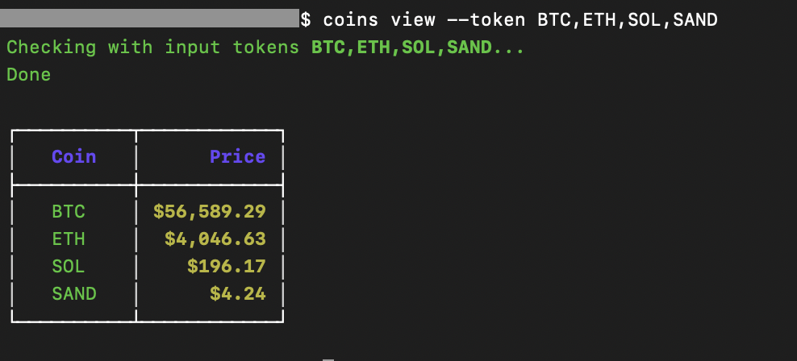
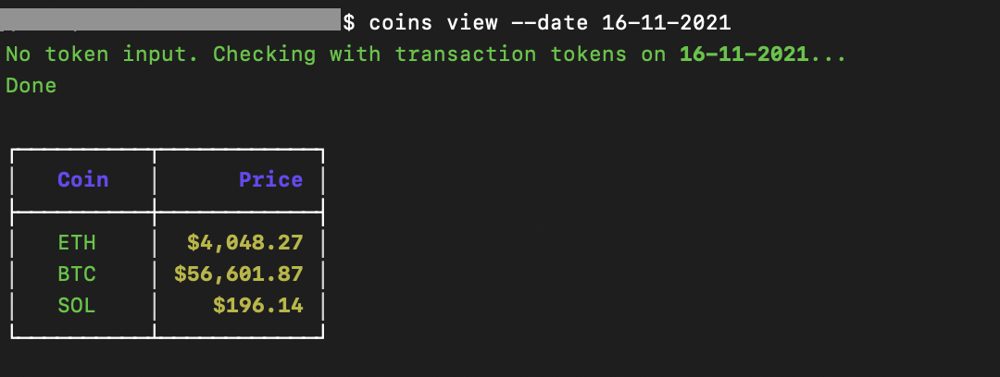
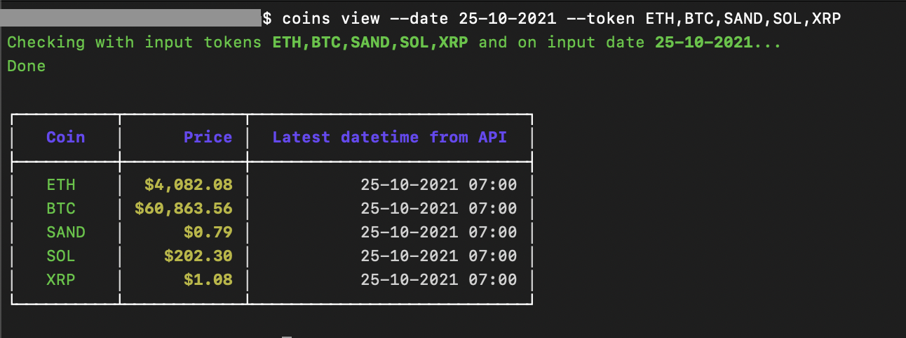

# Coins Price Checking CLI

NodeJS CLI interface app for checking cryptocurrency prices. After installing, you can run it anywhere with Terminal

Register an API key at https://min-api.cryptocompare.com/

## Usage

```
npm install

npm run copy-files

npm link
```

## Commands
### 1. Help and Version
```
# Help
coins -h

# Version
coins -V
```

<br />

### 2. View With No Params
View coins price command. Will check with latest tokens from transaction history(CSV log)
```
coins view
```
Sample Run



<br />

### 3. View specific tokens
```
coins view --token=BTC,ETH
```
Sample Run


---
<br />

### 4. View at specific date. Will check with tokens from transaction history at input date(CSV log)
```
coins view --date=15-11-2021
```
Sample Run



<br />

### 5. View specific coins at specific date
```
coins view --date=17-11-2021 --token=BTC,ETH,SOL
```
Sample Run



<br />

### Version

1.0.0

### License

MIT

### Reference
https://github.com/bradtraversy/coindex-cli
